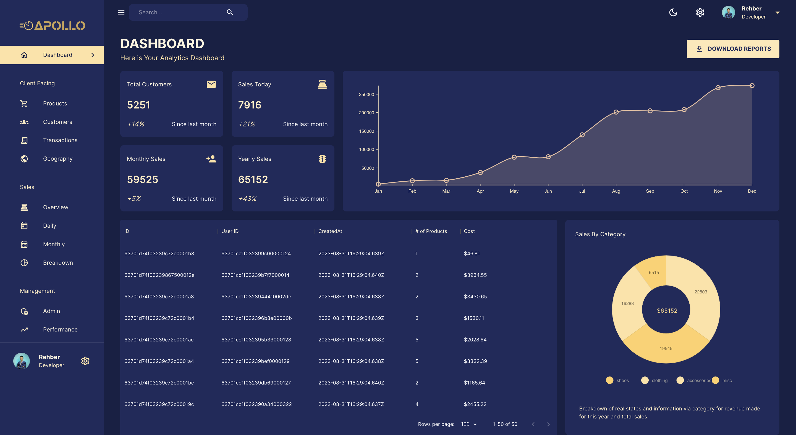

<p align="center">
  
</p>


<br/>

<p align="center">
  <a href="https://docflex.notion.site/Apollo-DataLytics-Simplified-328c9a24a77c4c2f97a352b582bfa13b?pvs=4">
    
  </a>
  <a href="https://github.com/docflex" target="_blank">
    
  </a>
  <a href="https://choosealicense.com/licenses/mit/" target="_blank">
    
  </a>
  <a href="https://apollo-qjza.onrender.com/" target="_blank">
    
  </a>
</p>


# 🚀 Apollo - DataLytics. Simplified
<p align="center">
  
</p>

Welcome to Apollo, your one-stop solution for Business Intelligence powered by the MERN Stack! 🚀 In this comprehensive README, we'll explore the features, technology stack, and how to run the project. Let's dive in! 🌟

## 📋 Project Overview
Apollo is designed to simplify Business Intelligence with its intuitive MERN Stack architecture. It empowers you to make data-driven decisions effortlessly. Explore insights, visualize data, and uncover trends – Apollo has got you covered! 📊🔍

## 🔑 Key Features
* 📊 Powerful Data Visualization: Apollo provides robust data visualization tools to help you interpret your data effectively. Visualize trends, patterns, and insights effortlessly. 📈📉

* 📈 Interactive Dashboards: Create customized, interactive dashboards to monitor key metrics in real-time. Stay informed and make decisions on the go. 📲👩‍💼

* 📁 Data Integration: Seamlessly integrate your data from various sources into Apollo. No more manual data entry – Apollo does the heavy lifting for you. 🔄📡

* 🛠️ User-Friendly Interface: Apollo's user-friendly interface ensures that you don't need to be a data scientist to harness its power. Get started with ease. 🙌🖥️

## 🔌 Technology Stack
* MERN Stack: Apollo leverages the power of MongoDB, Express, React, and Node.js to create a versatile and efficient platform. 💻🌐

* RESTful API: Apollo offers a RESTful API for seamless integration with your data sources. 📡🔌

* Authentication: Secure user authentication is implemented for data protection. 🔒🚦

* Docker: Easily deploy and manage Apollo across different environments using Docker. 🐳🚀

## 🏃‍♂️ Running The Project
To run Apollo locally, follow these steps:

### Step 1: Clone the Repository 📥
```
git clone https://github.com/docflex/Apollo
```

### Step 2: Set Up Environment 🌐

Create a .env file and add necessary environment variables (e.g., database connection, API keys, etc.)

### Step 3: Install Dependencies 📦

Install server dependencies
```
cd server
npm ci
```

Install client dependencies

```
cd ../client
npm ci
```

### Step 4: Run the Project 🚀

Start the server
```
cd ../server
npm run dev
```

Start the client
```
cd ../client
npm run start
```


That's it! Apollo should now be up and running locally. You can access it in your web browser at `http://localhost:3000`.

## 📖 Documentation
For more detailed information on Apollo, refer to the [DevLog](https://docflex.notion.site/Apollo-DataLytics-Simplified-328c9a24a77c4c2f97a352b582bfa13b?pvs=4).

## 🌟 Contributing
We welcome contributions to Apollo! If you'd like to contribute, please review our [contribution guidelines](CONTRIBUTING.md).

## 📝 License
This project is licensed under the MIT License. See the [LICENSE](LICENSE) file for details.
